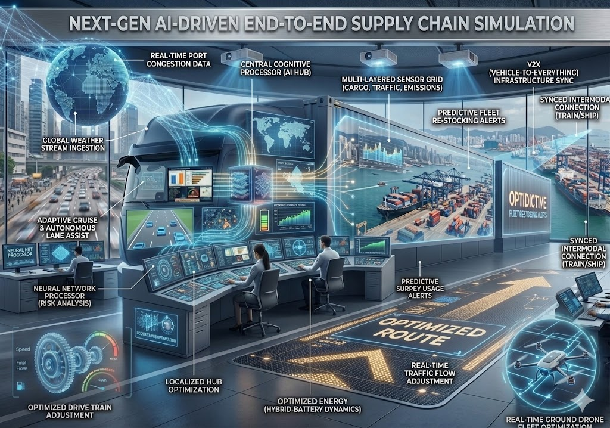

# Supply-Chain-Delay-Prediction

##  Project Overview
This project focuses on predicting delivery delays in logistics using Machine Learning.  
The system analyzes operational and environmental factors to help organizations take proactive decisions.

---

##  Business Problem
Delivery delays impact:
- Customer satisfaction
- Operational efficiency
- Logistics cost

This project provides a predictive solution to:
- Identify delay risks
- Optimize delivery planning
- Improve service reliability

---

##  Solution Approach
- Synthetic dataset generation (real-world simulation)
- Feature engineering based on logistics factors
- Machine Learning model training
- Model comparison for best performance
- Real-time prediction system

---

##  Features Used
- Distance (km)
- Traffic Level
- Weather Condition
- Vehicle Capacity
- Driver Experience
- Fuel Status
- Road Type
- Time of Day

---

##  Models Used
- Decision Tree
- Random Forest  (Best Performance)
- Logistic Regression

---

##  Results
- Random Forest achieved highest accuracy
- Key delay factors identified using feature importance

---

##  Prediction System
The system allows users to input delivery conditions and predicts:
- 🚨 Delay Expected
- ✅ On-Time Delivery

---

##  Tech Stack
- Python
- Pandas, NumPy
- Scikit-learn
- Matplotlib
- Google Colab

---

##  Dataset
- Generated synthetic dataset (100 records)
- Available in CSV and Excel format

---

##  Sample Output

## colab link
https://colab.research.google.com/drive/1oOTqRXpyf3oEJW015IzVmCg7wSKxNlVp#scrollTo=cVbf3aAJiH6p
---

##  Future Improvements
- Real-time GPS integration
- Live traffic API
- Dashboard using Power BI / Streamlit
- Automated alert system

---

##  Author 
Simarjeet Kaur 

## LinkedIn: 
https://www.linkedin.com/in/simarjeet-kaur2004/
